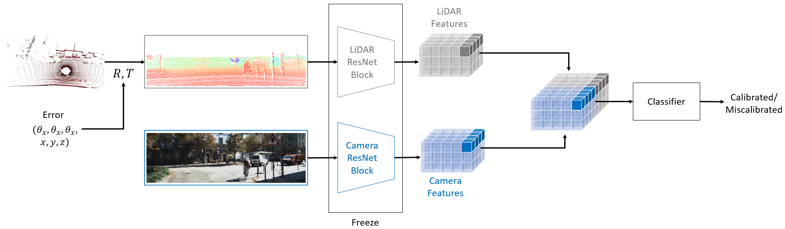

# MCDet: Real-Time Miscalibration Detection of LiDAR and Camera Sensors

This project explores **multimodal self-supervised learning (SSL)** techniques for monitoring the calibration of **LiDAR** and **camera** data using **contrastive learning**. The work aims to detect and correct sensor miscalibration in LiDAR projection into image plane.

## Project Overview

The project investigates how different calibration methods affect the alignment of feature representations between **LiDAR** and **image encoders**. Using **contrastive learning**, we develop a system that learns robust feature representations from both sensor modalities. We also employ **CKA analysis** to evaluate the similarity of the learned features across various layers of the encoders and **Evaluation Metrics** to quantify the detection results.



### Key Contributions
- **Open-Source Miscalibration Detection Framework**: We introduce an open-source framework for miscalibration detection using a self-supervised learning architecture and feature-based classification.
- **Two-Stage Learning**: This is the first two-stage learning approach for miscalibration detection. The first stage learns robust representations of miscalibrated sensor data, while the second stage trains the classification task using these representations.
- **Comperhensive Feature Analysis with CKA**: Using Centered Kernel Alignment (CKA), we analyze feature representations, enabling a simple architecture with faster inference and reduced computational requirements suitable for real-time use.
- **State-of-the-Art Performance**: Our approach achieves state-of-the-art detection performance, with inference time **6× faster** and a model size **42% smaller** than existing methods.

## Table of Contents
- [Usage](#usage)
- [Dataset](#dataset)
- [Results](#results)
- [Sources](#sources)

## Usage
### Training
```bash
python ./src/main.py --save_name (save_name) --classifier
```
`--save_name` refers to the name the outputs will be saved (e.g., resnet18_small_aug_241031) and also the configs file `configs_(save_name).yaml`. `--classifier` activates the classifier's training.

#### Configuration File Options

The following options are available for configuring the model via the `config.yaml` file:

| Parameter    | Options                      | Description                                                                       |
|--------------|------------------------------|-----------------------------------------------------------------------------------|
| `backbone`   | `resnet`                     | Specifies the model backbone architecture.                                        |
| `model_name` | `resnet_small`, `resnet_all` | Model variations for the selected backbone. (First two blocks and whole ResNet18) |
| `optimizer`  | `adam`, `adamw`              | Optimizer used for training the model.                                            |
| `dataset`    | `kitti_odom`, `kitti_raw`    | Different KITTI datasets.                                                         |

Furthermore, pre-trained encoders can be used by enabling `pretrained_encoder` and inserting the `save_name` in `pretrained_name`. 
The encoders can be further retrained by enabling `retrain` and giving the starting epoch. Lastly, the dataset and corresponding dataloader can be specified.

### Evaluation 
```bash
python ./inference/eval/main.py --save_name (save_name) --perturbation (CSV file) --eval_metrics --cka
```
`--perturbation` refers to CSV file, where the miscalibration errors are saved, e.g., `test_neg`, `test_unseen`. Two evaluation methods are implemented, namely evaluation metrics and CKA analysis. They can be enabled by giving `--eval_metrics` and `--cka` respectively.

### Docker run
The python scripts above can be run within Docker as implemented in `docker/Dockerfile` and `docker/Dockerfile_eval`. All outputs will be saved in `outputs/`.

```bash
docker build -t mmcl:latest -f docker/Dockerfile .
docker run --gpus all --shm-size=216g -v (root)/MCDet/data/kitti:/app/data/kitti -v (root)/MCDet/data/kitti_odom:/app/data/kitti_odom --name mmcl-container mmcl:latest
```

## Dataset
The paper used KITTI Odometry for the evaluation for a fair comparison to previous work by Wei. The code provides the possibility to use KITTI Raw dataset and further development for other datasets as well. In this code, we assume following data structure:

The directory structure of the KITTI Odometry dataset is as follows:
```bash
data/
└── kitti/
    └── kitti_odom/
        ├── sequences/
        │   ├── 00/
        │   ├── ...
        │   └── 21/
        ├── perturbation_(CSV file).txt
        ├── sequence_folder_(phase).txt
        └── sequence_list_(phase).txt
```
The CSV File contains the miscalibration data for good reproducability. In `sequence_folder_(phase).txt` and `sequence_list_(phase).txt`, the folder and file names from the sequences are saved for different phase, namely `train`, `val`, and `test`. 

For KITTI Raw:
```bash
data/ 
└── kitti/ 
    ├── 2011_09_26/ 
    ├── ... 
    ├── 2011_10_03/
    └── perturbation_(CSV file).txt
```
With the filenames for each phase saved as `eigen_(phase)_files.txt` in `src/datasets/dataloader/kitti_dataloader`.

## Results
The evaluation metrics for miscalibration detection with `resnet_small` and `kitti_odom` compared with the previous works:

| **Metrics**     | **Methods** | **All Errors** | **Rot Hard** | **Trans Easy** |
|------------------|-------------|----------------|--------------|----------------|
| **Accuracy**     | LCCNet      | 90.91%         | 86.48%       | 90.44%         |
|                  | Wei         | 95.13%         | 86.28%       | 92.05%         |
|                  | Ours        | **99.08%**     | **99.00%**   | **99.97%**     |
| **Precision**    | LCCNet      | 88.79%         | 78.69%       | 85.63%         |
|                  | Wei         | 92.02%         | 78.24%       | 86.59%         |
|                  | Ours        | **100.00%**    | **100.00%**  | **100.00%**    |
| **Recall**       | LCCNet      | 94.04%         | 99.51%       | 9<br/>7.38%         |
|                  | Wei         | **99.05%**     | **99.96%**   | 99.65%         |
|                  | Ours        | 98.17%         | 97.99%       | **99.93%**     |

The evaluation metrics for miscalibration detection with `resnet_small` (first 2 blocks) and `resnet_all` (whole ResNet18) evaluated on `kitti_odom`:

| **Metrics**   | **Encoders**      | **Miscalibrated** | **Unseen**   | **Rot Easy**   | **Rot Hard**   | **Trans Easy** | **Trans Hard** |
|----------------|-------------------|-------------------|--------------|----------------|----------------|----------------|----------------|
| **Accuracy**   |                  | **99.42%**        | **99.97%**   | **99.99%**     | **99.00%**     | **99.97%**     | **99.22%**     |
| **Precision**  | ResNet18-Small   | **100.00%**       | **100.00%**  | **100.00%**    | **100.00%**    | **100.00%**    | **100.00%**    |
| **Recall**     |                  | **98.84%**        | **99.93%**   | **99.98%**     | **97.99%**     | **99.93%**     | 98.44%         |
| **Accuracy**   |                  | 98.21%            | 99.36%       | 99.11%         | 94.02%         | 99.33%         | 98.56%         |
| **Precision**  | ResNet18-All     | 99.36%            | 99.37%       | 99.37%         | 99.30%         | 99.37%         | 97.75%         |
| **Recall**     |                  | 97.05%            | 99.35%       | 98.84%         | 88.66%         | 99.29%         | **99.36%**     |


## Sources
External sources for codes:

Kitti downloader is from https://github.com/Deepak3994/Kitti-Dataset.git

Kitti loader adapted from https://github.com/joseph-zhang/KITTI-TorchLoader
